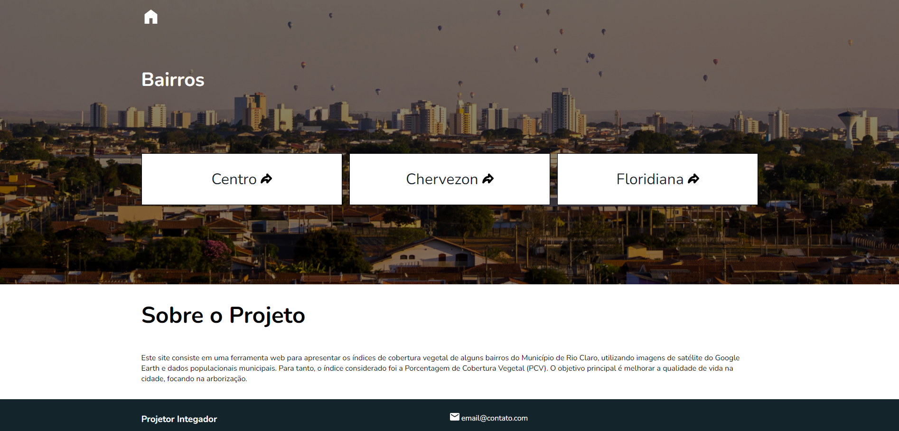

# Projetor Integrador - 2024

> Este [site](https://test-project-integrador-1.netlify.app/#) consiste em uma ferramenta web para apresentar os índices de cobertura vegetal de alguns bairros do Município de Rio Claro, utilizando imagens de satélite do Google Earth e dados populacionais municipais.

## O Índice Considerado

> Para tanto, o índice considerado foi a Porcentagem de Cobertura Vegetal (PCV). O objetivo principal é melhorar a qualidade de vida na cidade, focando na arborização.

#### Melhorias no README.md

- [ ] Seção design
- [ ] Seção processamento das images
- [ ] Seção html, css e JS
- [ ] Seção Django
- [ ] Seção Docker
- [ ] Seção PostgreSQL
- [ ] Seção Deploy
- [ ] Seção como rodar projeto localmente
- [ ] Seção como contribuir
- [ ] Seção Colaboradores
- [ ] Seção licença
